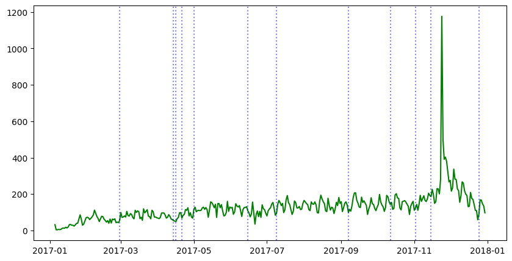
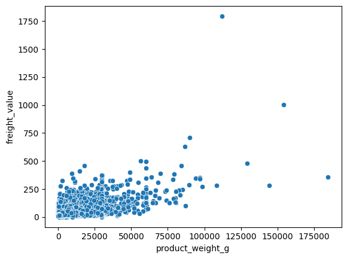

# Ecommerce Performance Insights — Olist #EDA


## Table of Contents

1. [Business Goal](#business-goal)
2. [About the Data](#about-the-data)
3. [Usage Examples](#usage-examples)
4. [Project Structure](#project-structure)
5. [Requirements](#requirements)
6. [Tests](#tests)
7. [Results / Output](#7-results--output)
8. [License](#license)
9. [Project Origin](#project-origin)

---

## 1. Business Goal

You are working for one of the largest e-commerce sites in Latin America. The Data Science team was asked to analyze company data to understand performance across key metrics during 2016–2018.

Two main areas to explore:
- **Revenue** — total revenue by year, most/least popular product categories, revenue by state.
- **Delivery** — delivery time by month, difference between estimated and actual delivery dates, and correlation with public holidays.

---

## 2. About the Data

Two data sources are combined:

1. **Olist Brazilian E-commerce Dataset** — 100k anonymized orders from 2016 to 2018 across multiple marketplaces in Brazil. Features cover order status, price, payment, freight, customer location, product attributes, and reviews.

   Data schema: `images/data_schema.png`
   
   Download: [Google Drive link](https://drive.google.com/file/d/1HIy4LNNQESuXUj-u_mNJTCGCRrCeSbo-/view?usp=share_link)

2. **[Public Holidays API](https://date.nager.at)** — Used to retrieve Brazil's public holidays and correlate them with delivery metrics.

<details>
  <summary>Data Schema 🗂️</summary>

  

</details>

---

## 3. Usage Examples

Run the main analysis notebook:

```bash
jupyter notebook Ecommerce-Performance-Insights.ipynb
```

Example insight from the analysis:

```
Year 2018 revenue: R$ 8.5M (+35% vs 2017)
Top category: health_beauty (R$ 1.2M)
Average delivery delay in December: +3.2 days vs estimated
```

---

## 4. Project Structure

<details>
  <summary>📂 Expand for Project Structure</summary>

```console
├── datasets/
│   ├── olist_customers_dataset.csv
│   ├── olist_geolocation_dataset.csv
│   ├── olist_order_items_dataset.csv
│   ├── olist_order_payments_dataset.csv
│   ├── olist_order_reviews_dataset.csv
│   ├── olist_orders_dataset.csv
│   ├── olist_products_dataset.csv
│   ├── olist_sellers_dataset.csv
│   └── product_category_name_translation.csv
├── images/
│   ├── data_schema.png
│   ├── freight_value_weight_relationship.png
│   └── orders_per_day_and_holidays.png
├── queries/
│   ├── delivery_date_difference.sql
│   ├── freight_value_weight_relationship.sql
│   ├── global_ammount_order_status.sql
│   ├── orders_per_day_and_holidays_2017.sql
│   ├── real_vs_estimated_delivered_time.sql
│   ├── revenue_by_category.sql
│   ├── revenue_by_month_year.sql
│   ├── revenue_per_state.sql
│   ├── top_10_least_revenue_categories.sql
│   └── top_10_revenue_categories.sql
├── src/
│   ├── __init__.py
│   ├── config.py
│   ├── extract.py
│   ├── load.py
│   ├── plots.py
│   └── transform.py
├── tests/
│   ├── __init__.py
│   ├── test_extract.py
│   ├── test_load.py
│   └── test_transform.py
├── Ecommerce-Performance-Insights.ipynb
├── README.md
└── requirements.txt
```
</details>

---

## 5. Requirements

```bash
pip install -r requirements.txt
```

- jupyter==1.0.0
- black==22.12.0
- duckdb==1.5.3
- matplotlib==3.6.2
- pandas==1.4.4
- numpy==1.22.4
- scipy==1.8.0
- statsmodels==0.13.2
- plotly_express==0.4.1
- requests==2.26.0
- seaborn==0.11.2
- nbformat==5.7.3
- pytest==7.2.1

---

## 6. Tests

```bash
pytest tests/
```

Tests cover data extraction and transformation modules.

---

## 7. Results / Output

Key findings from the 2016–2018 analysis:

- **Revenue:** 2018 closed at R$ 8.5M (+35% vs 2017), led by *health_beauty* (R$ 1.2M).
- **Delivery:** December shows the worst average delay (+3.2 days vs estimated), and order volume spikes around public holidays.

**Orders per day vs public holidays:**



**Freight value vs product weight:**



---

## 8. License

This project is licensed under the MIT License — see [LICENSE](LICENSE).

---

## 9. Project Origin

Based on the [Brazilian E-Commerce dataset](https://www.kaggle.com/datasets/olistbr/brazilian-ecommerce) on Kaggle. Thanks to AnyoneAI for their contribution and inspiration.
