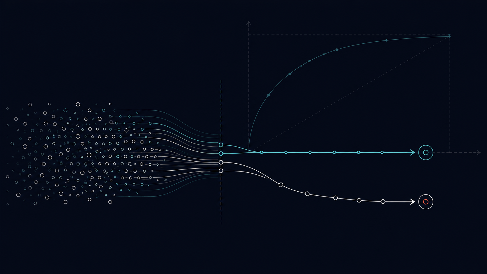

# Home Credit Default Risk #Classification

[](https://github.com/Dotto-Luis/Projects/actions/workflows/home-credit-default-risk-tests.yml)



## Table of Contents

1. [Business Goal](#1-business-goal)
2. [About the Data](#2-about-the-data)
3. [Usage Examples](#3-usage-examples)
4. [Project Structure](#4-project-structure)
5. [Requirements](#5-requirements)
6. [Tests](#6-tests)
7. [Results / Output](#7-results--output)
8. [License](#8-license)
9. [Project Origin](#9-project-origin)

---

## 1. Business Goal

This is a binary classification task: predict whether a home credit applicant will be able to repay their debt.

- `1` — client will have payment difficulties (late payment of more than X days on at least one of the first Y installments).
- `0` — all other cases.

Evaluation metric: **Area Under the ROC Curve (AUC-ROC)**, so models must return repayment default probabilities for each applicant.

---

## 2. About the Data

The dataset comes from the [Home Credit Default Risk Kaggle competition](https://www.kaggle.com/competitions/home-credit-default-risk/overview). The primary files used are:

- `application_train_aai.csv` — training data with labels (246,008 rows × 122 features).
- `application_test_aai.csv` — test data for prediction (61,503 rows).
- `HomeCredit_columns_description.csv` — feature descriptions.

Data covers loan applications with demographic info, credit history, and financial behavior. The train/test CSVs are downloaded automatically from Google Drive on first run (`src/data_utils.get_datasets`).

---

## 3. Usage Examples

```bash
# 1. Install dependencies (uses uv - https://docs.astral.sh/uv/)
uv sync

# 2. Run the analysis notebook (downloads data automatically on first run)
uv run jupyter notebook Home-Credit-Default-Risk.ipynb
```

Using the pipeline modules directly:

```python
from src.data_utils import get_datasets, get_feature_target, get_train_val_sets
from src.preprocessing import preprocess_data

app_train, app_test, _ = get_datasets()
X_train, y_train, X_test, y_test = get_feature_target(app_train, app_test)
X_train, X_val, y_train, y_val = get_train_val_sets(X_train, y_train)
train, val, test = preprocess_data(X_train, X_val, X_test)
```

---

## 4. Project Structure

<details>
  <summary>📂 Expand for Project Structure</summary>

```console
├── src/
│   ├── config.py            # Dataset paths and download URLs
│   ├── data_utils.py        # Download, feature/target split, train/val split
│   └── preprocessing.py     # Encoding, imputation, Min-Max scaling
├── tests/                   # Unit tests (synthetic data, no download needed)
│   ├── conftest.py
│   ├── test_data_utils.py
│   └── test_preprocessing.py
├── datasets/                # Data files (train/test gitignored, auto-downloaded)
├── Home-Credit-Default-Risk.ipynb
├── pyproject.toml           # Dependencies (managed with uv)
├── uv.lock                  # Locked, reproducible environment
└── README.md
```
</details>

---

## 5. Requirements

Managed with [uv](https://docs.astral.sh/uv/) — `pyproject.toml` + `uv.lock` give a reproducible environment:

```bash
uv sync
```

Key dependencies: pandas · numpy · scikit-learn · lightgbm · gdown · matplotlib · seaborn

---

## 6. Tests

```bash
uv run pytest tests
```

Unit tests run on synthetic data mimicking the Home Credit schema — no dataset download or network access required. They cover the download logic (mocked), feature/target separation, train/validation split, and the full preprocessing pipeline (encoding, imputation, scaling).

---

## 7. Results / Output

Validation ROC AUC by model:

| Model | Validation ROC AUC |
|---|---|
| Logistic Regression | 0.677 |
| Random Forest | 0.716 |
| **LightGBM (RandomizedSearchCV)** | **0.754** |

The preprocessing pipeline handles the `DAYS_EMPLOYED` anomaly (365243 → NaN), ordinal-encodes binary categoricals, one-hot-encodes multi-category features, imputes missing values with the median, and applies Min-Max scaling — all fitted only on the training set to avoid data leakage.

---

## 8. License

This project is licensed under the MIT License.

---

## 9. Project Origin

Based on the [Home Credit Default Risk](https://www.kaggle.com/competitions/home-credit-default-risk/overview) Kaggle competition dataset.
