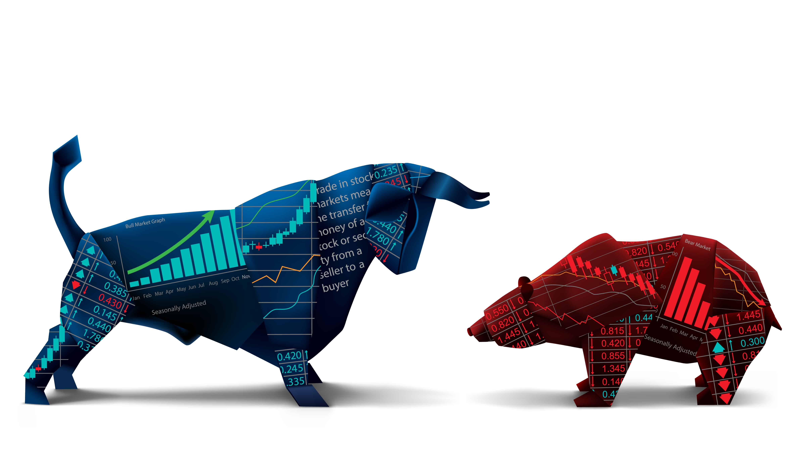

# Quantitative Finance — Fundamental Screener #WIP



> **Status: in active development.** The EDA phase and the screener skeleton are done and tested; valuation indicators, scoring profiles and live data are on the [roadmap](ROADMAP.md).

## Table of Contents

1. [Business Goal](#1-business-goal)
2. [About the Data](#2-about-the-data)
3. [Usage Examples](#3-usage-examples)
4. [Project Structure](#4-project-structure)
5. [Requirements](#5-requirements)
6. [Tests](#6-tests)
7. [Results / Output](#7-results--output)
8. [License](#8-license)
9. [Project Origin](#9-project-origin)

---

## 1. Business Goal

**Systematize fundamental analysis**: a stock screener that computes fundamental indicators from 10-K data (profitability, leverage, growth), converts them into cross-sectional percentile ranks — optionally within each GICS sector — and combines them into a configurable composite score. The weights encode the investment philosophy and will grow into investor-profile presets (value / growth / quality).

The end vision adds an LLM layer that explains each company's score in natural language — connecting this project with the LLM patterns from the rest of the portfolio. See [ROADMAP.md](ROADMAP.md).

*All output is analytical information, not investment advice.*

---

## 2. About the Data

[NYSE dataset on Kaggle](https://www.kaggle.com/datasets/dgawlik/nyse) (Yahoo Finance + SEC EDGAR): split-adjusted daily prices (2010–2016), company/sector metadata, and annual 10-K fundamentals (2012–2016). Download the CSVs into `data/` (gitignored). A later roadmap phase replaces this with live data (SEC EDGAR / yfinance).

---

## 3. Usage Examples

```bash
# 1. Download the Kaggle CSVs into data/

# 2. Install the environment (uses uv - https://docs.astral.sh/uv/)
uv sync

# 3. Run the screener
uv run python -m src.screener --top 20
uv run python -m src.screener --top 10 --by-sector
```

Exploratory analysis (CRISP-DM): `Quantitative-Finance-Data-Analysis.ipynb`.

---

## 4. Project Structure

<details>
  <summary>📂 Expand for Project Structure</summary>

```console
├── src/
│   ├── config.py           # Paths, column mapping, scoring weights
│   ├── indicators.py       # ROE, margins, leverage, revenue growth
│   ├── scoring.py          # Percentile ranks + weighted composite score
│   └── screener.py         # CLI: load -> indicators -> score -> top N
├── tests/                  # Unit tests (synthetic data)
├── data/                   # Kaggle CSVs (gitignored)
├── Quantitative-Finance-Data-Analysis.ipynb   # EDA (CRISP-DM)
├── ROADMAP.md              # Development phases and design notes
├── pyproject.toml          # Environment (managed with uv)
└── README.md
```
</details>

---

## 5. Requirements

Managed with [uv](https://docs.astral.sh/uv/):

```bash
uv sync
```

Dependencies: pandas · numpy · matplotlib · seaborn · plotly · scipy · funpymodeling · jupyter (+ pytest for development)

---

## 6. Tests

```bash
uv run pytest tests -v
```

Eight unit tests on synthetic fundamentals: indicator math (ROE, margins, YoY growth), leverage ordering, latest-period snapshot, percentile ranking (global and intra-sector), composite scoring and missing-data handling.

---

## 7. Results / Output

Real output on the 2016 snapshot (`python -m src.screener --top 5`):

```
Ticker Symbol                  sector  score   roe  net_margin  gross_margin  revenue_growth
         GILD             Health Care   91.9  0.98        0.55          0.88            0.31
           MA  Information Technology   87.6  0.72        0.38          1.00            0.11
         EBAY  Information Technology   85.9  0.69        0.81          0.78            0.05
         PCLN  Consumer Discretionary   85.2  0.29        0.28          0.93            0.09
         BIIB             Health Care   84.7  0.31        0.32          0.87            0.06
```

A credible 2016 quality/profitability screen — peak-Sovaldi Gilead on top, followed by the great capital-light compounders. Known refinements queued in the roadmap: extreme-ROE artifacts from tiny book equity (e.g. buyback-heavy companies) call for outlier capping or ROIC.

The EDA notebook develops the data understanding behind it: univariate/bivariate/multivariate analysis of prices, fundamentals and sectors, plus data-quality assessment.

---

## 8. License

This project is licensed under the MIT License.

---

## 9. Project Origin

Personal project — systematizing years of discretionary fundamental analysis into code. Dataset: [New York Stock Exchange](https://www.kaggle.com/datasets/dgawlik/nyse) (Kaggle). Methodology: CRISP-DM for the exploratory phase.
