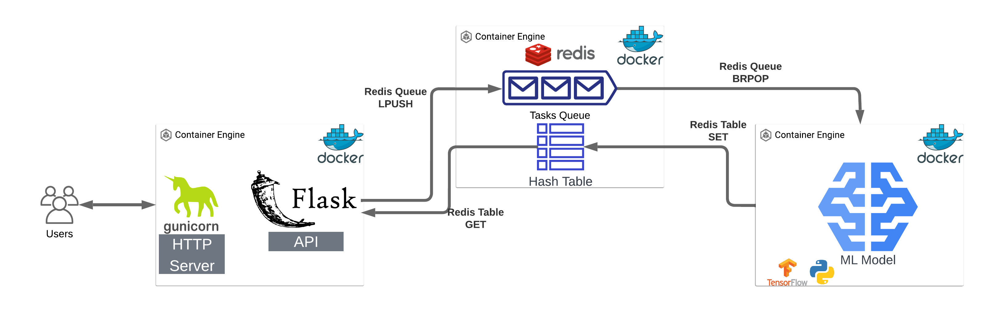

# Auto Image CNN — Flask ML API #DeepLearning


## Table of Contents

1. [Business Goal](#1-business-goal)
2. [About the Data](#2-about-the-data)
3. [Usage Examples](#3-usage-examples)
4. [Project Structure](#4-project-structure)
5. [Requirements](#5-requirements)
6. [Tests](#6-tests)
7. [Results / Output](#7-results--output)
8. [License](#8-license)
9. [Project Origin](#9-project-origin)

---

## 1. Business Goal

Companies with large image collections need to classify images automatically — doing it manually is slow and error-prone. This project serves a pre-trained CNN (ImageNet, 1,000+ categories) as a **production-style microservice stack**:

- **Web UI + Flask API**: upload an image, get the predicted class and confidence as JSON.
- **Model service**: separate container running TensorFlow inference.
- **Redis** as message broker between services — the API never blocks on the model: requests are queued and consumed asynchronously.
- **Docker Compose** orchestrates the three services; **Locust** provides load testing.

The point of the architecture: API and model scale independently — under load you add model replicas without touching the API.

### Architecture



---

## 2. About the Data

No custom dataset: the model service loads a CNN pre-trained on **ImageNet** (1,000+ classes). Any JPEG/PNG/GIF image can be submitted through the UI or the API.

---

## 3. Usage Examples

Requires [Docker Desktop](https://www.docker.com/products/docker-desktop/) running.

```bash
# 1. Configure environment (set your UID/GID: run `id -u` and `id -g`)
cp .env.original .env

# 2. Start the stack: API + model service + Redis
docker-compose up --build -d

# On Apple Silicon (M-series), force x86 emulation instead
# (tensorflow 2.8 has no ARM wheels):
DOCKER_DEFAULT_PLATFORM=linux/amd64 docker-compose up --build -d

# 3. Wait until the 3 services are Up (model takes ~1 min to load weights)
docker-compose ps

# 4. Open the UI and upload a JPEG/PNG/GIF
#    http://localhost
```

> Note: HEIC images (iPhone default) are not supported — convert to JPEG/PNG first. The first prediction takes longer while the model warms up.

Or hit the API directly:

```bash
curl -X POST http://localhost/predict -F "file=@stress_test/dog.jpeg"
# {"success": true, "prediction": "Eskimo_dog", "score": 0.9346}
```

Load testing with Locust:

```bash
cd stress_test && locust -f locustfile.py --host http://localhost
```

---

## 4. Project Structure

<details>
  <summary>📂 Expand for Project Structure</summary>

```console
├── api/                       # Flask API + Web UI (own Dockerfile)
│   ├── app.py
│   ├── views.py               # Endpoints: / (UI), /predict, /feedback
│   ├── middleware.py          # Redis queue: publish job, wait for result
│   ├── utils.py               # File validation, MD5-based filenames
│   └── tests/                 # Unit tests (model mocked)
├── model/                     # TensorFlow inference service (own Dockerfile)
│   ├── ml_service.py          # Redis consumer + CNN prediction
│   └── tests/                 # Real-inference test (run via Docker)
├── stress_test/
│   └── locustfile.py          # Load testing scenarios
├── tests/
│   └── test_integration.py    # End-to-end test (requires running stack)
├── docker-compose.yml         # api + model + redis
├── Makefile
├── pyproject.toml             # Dev/test environment (managed with uv)
└── README.md
```
</details>

---

## 5. Requirements

Services run with **Docker Compose** (each service has its own Dockerfile and pinned requirements). For local development and unit tests, the dev environment is managed with [uv](https://docs.astral.sh/uv/):

```bash
uv sync
```

---

## 6. Tests

Three levels, from lightest to heaviest:

**1. API unit tests** (seconds, no Docker — model mocked; these run in CI):

```bash
uv sync
cd api && uv run --project .. pytest tests -v
# Expected: 8 passed
```

**2. Model service test** (real TensorFlow inference, via Docker — downloads model weights on first run):

```bash
cd model && docker build -t model_test --progress=plain --target test .
# On Apple Silicon add: --platform linux/amd64
```

**3. Integration test** (end-to-end, requires the stack running — see Usage):

```bash
uv run python tests/test_integration.py
# Expected: Ran 2 tests ... OK
```

---

## 7. Results / Output

The stack serves predictions end-to-end: an uploaded image is hashed (MD5) for deduplication, queued in Redis, consumed by the model service, and the prediction is returned to the UI/API:

```json
{"success": true, "prediction": "Eskimo_dog", "score": 0.9346}
```

Under load testing with Locust, the async queue keeps the API responsive while the model service processes jobs at its own pace — the bottleneck (inference) is isolated and horizontally scalable.

---

## 8. License

This project is licensed under the MIT License.

---

## 9. Project Origin

Based on an AnyoneAI sprint project focused on deploying CNN models as production-ready Flask microservices.
