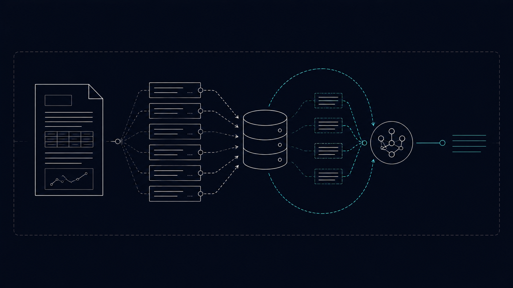
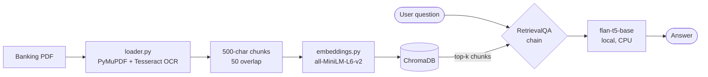

# GenerativeAI-Banking-RAG-Chatbot

[](https://github.com/Dotto-Luis/Projects/actions/workflows/banking-rag-chatbot-tests.yml)



## Table of Contents

1. [Business Goal](#1-business-goal)
2. [About the Data](#2-about-the-data)
3. [Usage Examples](#3-usage-examples)
4. [Project Structure](#4-project-structure)
5. [Requirements](#5-requirements)
6. [Tests](#6-tests)
7. [Results / Output](#7-results--output)
8. [License](#8-license)
9. [Project Origin](#9-project-origin)

---

## 1. Business Goal

A banking assistant that answers natural-language questions about banking documents (PDFs) — account terms, fee policies, mortgage conditions. Runs **fully local**: no API keys, no data leaves the machine, which matters when the documents are confidential financial material.

The system uses RAG (Retrieval-Augmented Generation) with a local LLM:

- **OCR ingestion** (PyMuPDF + Tesseract): extracts text from scanned banking PDFs.
- **Chunking + embeddings** (sentence-transformers `all-MiniLM-L6-v2`) stored in **ChromaDB**.
- **Local seq2seq LLM** (`google/flan-t5-base`, CPU-friendly) wrapped in a **LangChain** RetrievalQA chain with a custom prompt.
- **CLI interface** for ingestion and interactive chat.

### Architecture



---

## 2. About the Data

Publicly available banking documents in PDF format — the repo includes a real example: `data/Spain_unicaja_Fixed_Mortage.pdf` (Unicaja fixed-mortgage terms, Spain). Any banking PDF works: account terms, product manuals, legal documents.

Processing: pages are OCR'd at 300 DPI, joined, and split into 500-character chunks with 50-character overlap before embedding.

---

## 3. Usage Examples

```bash
# 1. Install dependencies (uses uv - https://docs.astral.sh/uv/)
#    Requires Tesseract OCR: brew install tesseract (macOS) / apt install tesseract-ocr (Linux)
uv sync

# 2. Download the local models (one-time, ~1GB)
uv run python src/model_downloader.py

# 3. Ingest a banking PDF into the vector DB
uv run python -m app.chatbot_interface ingest data/Spain_unicaja_Fixed_Mortage.pdf

# 4. Chat with your documents
uv run python -m app.chatbot_interface chat
```

Example questions:

```
"What is the interest rate on the fixed mortgage?"
"What fees apply to early repayment?"
"What documents do I need to apply?"
```

---

## 4. Project Structure

<details>
  <summary>📂 Expand for Project Structure</summary>

```console
├── app/
│   └── chatbot_interface.py   # CLI: ingest + interactive chat
├── src/
│   ├── loader.py              # OCR PDF -> text chunks
│   ├── embeddings.py          # Chunks -> ChromaDB vector store
│   ├── rag_chain.py           # RetrievalQA chain with local LLM
│   ├── prompts.py             # Custom prompt template
│   └── model_downloader.py    # One-time model download
├── data/
│   └── Spain_unicaja_Fixed_Mortage.pdf
├── notebooks/
│   └── Exploratory_Testing.ipynb
├── tests/                     # Unit tests (all external calls mocked)
├── pyproject.toml             # Dependencies (managed with uv)
├── uv.lock                    # Locked, reproducible environment
└── README.md
```
</details>

---

## 5. Requirements

Managed with [uv](https://docs.astral.sh/uv/):

```bash
uv sync
```

Key dependencies: langchain · langchain-huggingface · langchain-chroma · transformers · torch (CPU wheels on Linux) · chromadb · pymupdf · pytesseract

System dependency: [Tesseract OCR](https://github.com/tesseract-ocr/tesseract) for PDF ingestion.

---

## 6. Tests

```bash
uv run pytest tests
```

Unit tests mock all heavy dependencies (OCR, embeddings model, LLM, vector store) — no model downloads or network access required. They cover the chunking logic (size, overlap, no text loss), the embedding/persistence flow, and the RAG chain wiring (vector store, local pipeline, custom prompt).

---

## 7. Results / Output

Given an ingested mortgage document, the chatbot answers questions grounded in the retrieved chunks:

> **Q:** "What are the requirements to open a commission-free account?"
>
> **A:** "To avoid commissions, the customer must direct deposit income and meet basic requirements such as maintaining a monthly average balance."

The pipeline runs entirely on CPU with a ~250M-parameter model — answers are grounded but concise; swapping `model_id` for a larger local model improves fluency at the cost of latency.

---

## 8. License

This project is licensed under the MIT License.

---

## 9. Project Origin

Built on publicly available banking documents (Unicaja mortgage terms). Refactored to modern LangChain APIs (`langchain-huggingface`, `langchain-chroma`), consistent local model (`flan-t5-base`), CLI interface, isolated unit tests, and uv-managed dependencies.
