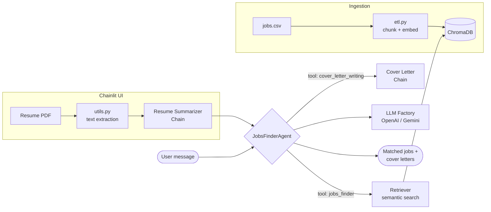

# IT LLM Job Finder Agent #AIAgents

[](https://github.com/Dotto-Luis/Projects/actions/workflows/it-llm-job-finder-tests.yml)


## Table of Contents

1. [Business Goal](#1-business-goal)
2. [About the Data](#2-about-the-data)
3. [Usage Examples](#3-usage-examples)
4. [Project Structure](#4-project-structure)
5. [Requirements](#5-requirements)
6. [Tests](#6-tests)
7. [Results / Output](#7-results--output)
8. [License](#8-license)
9. [Project Origin](#9-project-origin)

---

## 1. Business Goal

An LLM-powered job-matching agent: upload your resume and it finds relevant job postings, explains why each one fits, and writes tailored cover letters on demand.

The system combines an agent with tool-calling and a RAG pipeline over a job-postings database:

- An **ETL pipeline** ingests a CSV of job listings, chunks the text, and stores embeddings in **ChromaDB**.
- A **resume summarizer chain** condenses the uploaded resume (PDF) into a profile used for retrieval.
- A **job finder assistant** runs semantic search over the vector store and matches postings to the profile.
- A **LangChain agent** orchestrates two tools — `jobs_finder` and `cover_letter_writing` — with conversation memory.
- A **Chainlit** chat UI exposes three profiles: vanilla chat, jobs assistant, and the full agent.
- An **LLM factory** switches between **OpenAI** and **Google Gemini** via a single env variable.

### Architecture



---

## 2. About the Data

The project uses a CSV of IT job postings (title, company, description, seniority level, employment type, location, salary and post URL). The ETL pipeline embeds each posting into a ChromaDB vector database for semantic search.

The repo ships with `dataset/jobs_sample.csv` (300 postings) so it runs out of the box. To use a full dataset, place it at `dataset/jobs.csv` or set `DATASET_PATH` in `.env` — the config picks it up automatically.

---

## 3. Usage Examples

```bash
# 1. Configure environment
cp env.example .env        # then set OPENAI_API_KEY (or GOOGLE_API_KEY + LLM_PROVIDER="gemini")

# 2. Build the vector database
python backend/etl.py

# 3. Launch the chat UI
python -m chainlit run -w backend/app.py
```

Then open the Chainlit UI, pick the **Jobs Agent** profile, upload your resume (PDF), and ask: *"Find me jobs that match my profile."*

---

## 4. Project Structure

<details>
  <summary>📂 Expand for Project Structure</summary>

```console
├── backend/
│   ├── app.py                        # Chainlit app entry point (3 chat profiles)
│   ├── config.py                     # Pydantic settings (providers, paths, models)
│   ├── etl.py                        # ETL pipeline: CSV → chunks → ChromaDB
│   ├── llm_factory.py                # LLM provider factory (OpenAI / Gemini)
│   ├── retriever.py                  # Semantic search over the Chroma vector store
│   ├── utils.py                      # PDF text extraction
│   └── models/
│       ├── chatgpt_clone.py          # General chat assistant
│       ├── jobs_finder.py            # RAG job-matching assistant
│       ├── jobs_finder_agent.py      # Agent with jobs_finder + cover_letter tools
│       └── resume_summarizer_chain.py
├── dataset/
│   └── jobs_sample.csv               # 300-row sample (full dataset is gitignored)
├── tests/                            # Unit tests (LLM calls and retriever mocked)
├── env.example
├── requirements.txt
└── README.md
```
</details>

---

## 5. Requirements

```bash
pip install -r requirements.txt
```

Key dependencies:
- langchain · langchain-openai · langchain-google-genai
- chromadb · sentence-transformers
- chainlit
- pandas · pypdf
- pytest · black · isort

---

## 6. Tests

```bash
python -m pytest tests
```

Six unit tests cover the ETL pipeline, retriever, PDF utilities, chat assistant, and the agent. All external calls (LLM APIs, embeddings, vector store) are mocked — no API keys needed to run the suite.

---

## 7. Results / Output

Given an uploaded resume, the agent:

1. Summarizes the candidate profile.
2. Retrieves the top-k matching postings from the vector store and suggests 2–5 roles, each with a one-line fit explanation.
3. On request, drafts a cover letter tailored to a specific posting using the resume and job description.

---

## 8. License

This project is licensed under the MIT License — see [LICENSE](LICENSE).

---

## 9. Project Origin

Built on a dataset of ~8,000 IT job postings (LinkedIn-format fields). Extended with multi-provider LLM support (OpenAI and Google Gemini) via a factory pattern, a local agent prompt (no LangChain Hub dependency), and isolated unit tests.
