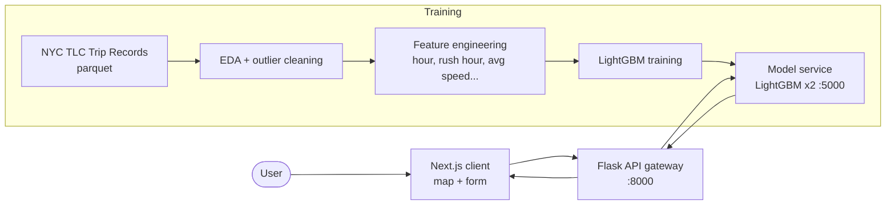

# NYC Taxi Fare & Trip Duration Prediction #Regression


## Table of Contents

1. [Business Goal](#1-business-goal)
2. [About the Data](#2-about-the-data)
3. [Usage Examples](#3-usage-examples)
4. [Project Structure](#4-project-structure)
5. [Requirements](#5-requirements)
6. [Tests](#6-tests)
7. [Results / Output](#7-results--output)
8. [License](#8-license)
9. [Project Origin](#9-project-origin)

---

## 1. Business Goal

Predict **taxi fare and trip duration before the ride starts**, using only information available at pickup: distance, date and time. Accurate upfront estimates help passengers make commuting decisions and help drivers pick profitable rides.

Full-stack ML system with three Dockerized services:

- **Model service**: LightGBM regressors (one for fare, one for duration) behind a Flask endpoint, with feature engineering shared between training and inference.
- **API gateway**: Flask service that validates input and forwards to the model service.
- **Web client**: Next.js app with an interactive map to pick up/drop-off points and get instant estimates.

### Architecture



---

## 2. About the Data

[NYC TLC Trip Record Data](https://www.nyc.gov/site/tlc/about/tlc-trip-record-data.page) — Yellow Taxi Trip Records, 2022 (parquet, one file per month; May 2022 used as the working set, ~3.4M trips). Features engineered from pickup time and distance: hour of day, rush hour flag, day of week, squared distance, and historical average speed per hour.

---

## 3. Usage Examples

Full stack with Docker Compose (model service + API + web client):

```bash
docker-compose up --build -d
# Client:  http://localhost:3000
# API:     http://localhost:8000
```

Direct API call:

```bash
curl -X POST http://localhost:8000/predict \
  -H "Content-Type: application/json" \
  -d '{"trip_distance": "5.2", "pickup_date": "2022-05-02", "pickup_time": "17:30"}'
# {"fare": 18.5, "duration": 22.3}
```

Training pipeline (order matters — each notebook downloads its own data):

```bash
uv sync --group train
cd model
# 1. Build the average-speed-per-hour dictionary (required by training)
uv run --project .. jupyter nbconvert --to notebook --execute avg_speed.ipynb --output avg_speed_executed.ipynb --ExecutePreprocessor.timeout=1800
# 2. Train the LightGBM models (produces the .model artifacts the service loads)
uv run --project .. jupyter nbconvert --to notebook --execute model_train.ipynb --output model_train_executed.ipynb --ExecutePreprocessor.timeout=1800
```

---

## 4. Project Structure

<details>
  <summary>📂 Expand for Project Structure</summary>

```console
├── eda/
│   └── eda.ipynb                # Exploratory analysis, outlier study
├── model/
│   ├── preprocessing.py         # Feature engineering (shared train/inference)
│   ├── model_train.ipynb        # LightGBM training + evaluation
│   ├── model_test.ipynb
│   ├── app_model.py             # Inference service (Flask)
│   └── Dockerfile
├── webapp/
│   ├── api/                     # Flask API gateway
│   └── client/                  # Next.js app (map, form, prediction UI)
├── dataset/                     # TLC parquet files (gitignored)
├── docs/                        # Report + data dictionary
├── tests/                       # Unit tests (model service mocked)
├── docker-compose.yml           # model + api + client
├── pyproject.toml               # Dev/test environment (managed with uv)
└── README.md
```
</details>

---

## 5. Requirements

Services run with **Docker Compose** (each has its own Dockerfile). For local development and unit tests, the dev environment is managed with [uv](https://docs.astral.sh/uv/):

```bash
uv sync
```

---

## 6. Tests

```bash
uv run pytest tests -v
```

Nine unit tests, no dataset or trained models required: feature engineering functions (hour zones, rush hour, trip duration, outlier filtering, dataset split) and the API gateway with the model service mocked (success and degraded-error paths).

---

## 7. Results / Output

LightGBM on May 2022 test split:

| Target | RMSE | R² |
|---|---|---|
| **Fare amount** | $2.90 | **0.94** |
| **Trip duration** | 5.4 min | **0.82** |

Fare is highly predictable from distance and time features alone; duration carries more irreducible noise (traffic, route). The web client returns both estimates from a pickup point, drop-off point and datetime.

---

## 8. License

This project is licensed under the MIT License — see [LICENSE](LICENSE).

---

## 9. Project Origin

**Team project** (AnyoneAI final project) built with [@xtianhb](https://github.com/xtianhb) — original repo: [xtianhb/nyc_taxi_ml](https://github.com/xtianhb/nyc_taxi_ml). My contributions: exploratory data analysis, feature engineering (`preprocessing.py`), model training and evaluation (LightGBM), and the API/model service integration. Data: [NYC Taxi & Limousine Commission](https://www.nyc.gov/site/tlc/about/tlc-trip-record-data.page).
