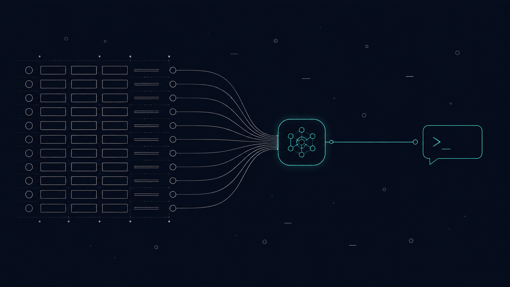
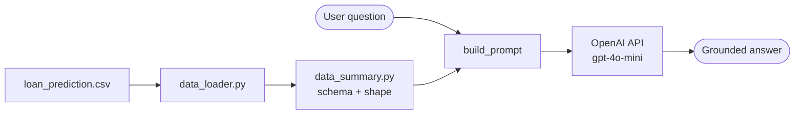

# OpenAI-Agent-Toolkit




## Table of Contents

1. [Business Goal](#1-business-goal)
2. [About the Data](#2-about-the-data)
3. [Usage Examples](#3-usage-examples)
4. [Project Structure](#4-project-structure)
5. [Requirements](#5-requirements)
6. [Tests](#6-tests)
7. [Results / Output](#7-results--output)
8. [License](#8-license)
9. [Project Origin](#9-project-origin)

---

## 1. Business Goal

A conversational AI agent that lets non-technical users query a loan-applications dataset in plain English — no SQL, no pandas. The agent injects a structural summary of the dataset into the LLM context and answers questions grounded in it.

Design decisions worth noting:

- **Lazy client initialization**: importing the package never requires an API key — the OpenAI client is created on first use, which keeps tests and tooling credential-free.
- **Prompt built as a pure function** (`build_prompt`), testable in isolation from the API.
- **Context injection over fine-tuning**: the dataset schema travels in the prompt, so swapping the CSV requires zero model work.

### Architecture



---

## 2. About the Data

`data/loan_prediction.csv` — 614 loan applications with demographic and financial features (gender, education, income, loan amount, credit history, property area) and the approval outcome (`Loan_Status`). Small enough to ship with the repo.

---

## 3. Usage Examples

```bash
# 1. Install dependencies (uses uv - https://docs.astral.sh/uv/)
uv sync

# 2. Configure your API key
cp env.example .env

# 3. Run the interactive agent
uv run python main.py
```

Example session:

```
Your question: What columns does the dataset have?
Your question: How many applicants are self-employed?
Your question: exit
```

---

## 4. Project Structure

<details>
  <summary>📂 Expand for Project Structure</summary>

```console
├── src/
│   ├── agent/
│   │   ├── ai_agent.py        # Prompt building + LLM call
│   │   └── openai_client.py   # Lazy OpenAI client (no key needed at import)
│   └── utils/
│       ├── data_loader.py     # CSV -> DataFrame
│       └── data_summary.py    # DataFrame -> schema summary for the prompt
├── data/
│   └── loan_prediction.csv
├── tests/                     # Unit tests (OpenAI API mocked)
├── main.py                    # Interactive CLI loop
├── env.example
├── pyproject.toml             # Dependencies (managed with uv)
├── uv.lock
└── README.md
```
</details>

---

## 5. Requirements

Managed with [uv](https://docs.astral.sh/uv/):

```bash
uv sync
```

Dependencies: openai · pandas · python-dotenv (+ pytest for development)

---

## 6. Tests

```bash
uv run pytest tests
```

Five unit tests, no API key or network needed: data loading, dataset summary, prompt composition, the mocked LLM call (model, temperature and prompt content verified), and the fail-fast error when the key is missing.

---

## 7. Results / Output

Given the loan dataset, the agent answers structural and analytical questions grounded in the injected context:

> **Q:** "How many rows does the dataset have and what is the target variable?"
>
> **A:** "The dataset has 614 rows; the target variable is Loan_Status."

Answers are constrained by the prompt to be final and concise (no code, no chain-of-thought), making the CLI usable by non-technical stakeholders.

---

## 8. License

This project is licensed under the MIT License.

---

## 9. Project Origin

Inspired by [Building an AI Agent using OpenAI API](https://amanxai.com/2025/04/29/building-an-ai-agent-using-openai-api/). Refactored with lazy client initialization, testable prompt composition, mocked unit tests, and uv-managed dependencies.
