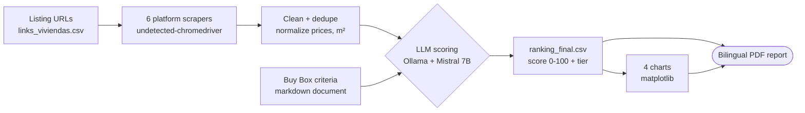
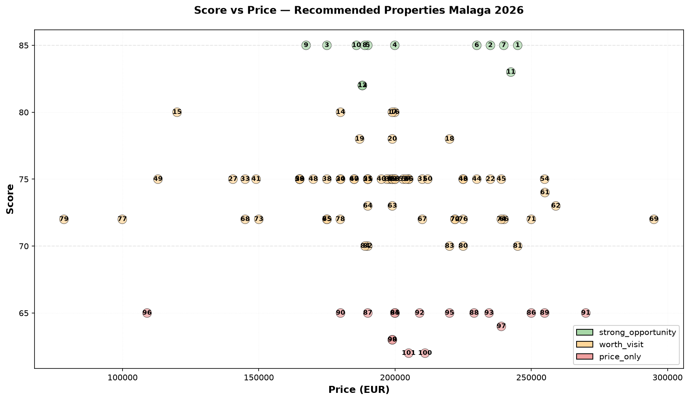

# Casitas — Real Estate Investment Screener (Málaga) #LLM #WebScraping

[](https://github.com/Dotto-Luis/Projects/actions/workflows/casitas-tests.yml)


## Table of Contents

1. [Business Goal](#1-business-goal)
2. [About the Data](#2-about-the-data)
3. [Usage Examples](#3-usage-examples)
4. [Project Structure](#4-project-structure)
5. [Requirements](#5-requirements)
6. [Tests](#6-tests)
7. [Results / Output](#7-results--output)
8. [License](#8-license)
9. [Project Origin](#9-project-origin)

---

## 1. Business Goal

A family searching for a home in Málaga was sharing listings in a WhatsApp group and comparing them by hand — reopening dozens of tabs, re-checking prices and €/m², losing track of which flats they had already dismissed and why. The process was taking weeks and producing no comparable criteria.

This pipeline replaces that manual work end to end: it takes the listing URLs they had already collected, scrapes the details from **7 Spanish real estate platforms**, scores every property against a written **Buy Box** (explicit investment criteria) using a **local LLM**, and delivers a **bilingual PDF report** ranking the opportunities.

Design decisions worth noting:

- **Local LLM (Ollama + Mistral 7B)** — no API keys, no cloud, no cost per property. Property data never leaves the machine, which matters when the input is someone's private house search.
- **Written criteria as a document** (`config/buy_box_malaga_2026.md`) rather than hardcoded thresholds: the investment thesis is versioned, reviewable and editable by a non-programmer.
- **Respectful scraping** — randomized waits (`4-15s` between requests, `25-45s` every 8-12) instead of hammering the platforms.
- **Deliverable designed for humans**, not analysts: 4-page bilingual PDF (EN/ES) with traffic-light tiers, because the people deciding are not the person who wrote the code.

### Architecture



---

## 2. About the Data

Property listings scraped from **Idealista, Fotocasa, Pisos.com, YaEncontre, Tecnocasa and Habitaclia** — 136 properties in Málaga (July 2026 snapshot).

Column names are kept in Spanish throughout the pipeline (`titulo`, `ubicacion`, `precio`, `m2`, `habitaciones`, `baños`, `planta`, `ascensor`, `estado`, `año`, `plataforma`) because that is what the sources provide; only comments, logs and analysis output are in English.

> **Privacy note:** the raw scraped data is **not published**. Listings include an `anunciante` field with agent names and phone numbers — third-party personal data that has no place in a public repo. This repository ships only:
> - `data/processed/sample_anonymized.csv` — 30 rows with the `anunciante` column removed, so the scoring stage can be run without scraping.
> - `data/output/` — the final ranking (no contact data), the 4 charts and the PDF report.

---

## 3. Usage Examples

**Prerequisites:** Python 3.10+, [uv](https://docs.astral.sh/uv/), and [Ollama](https://ollama.com) running locally with Mistral pulled.

```bash
# 0. Local LLM (one-time, ~4GB)
ollama serve
ollama pull mistral

# 1. Install dependencies
uv sync
```

**Option A — Score the included sample (no scraping, fastest path):**

```bash
uv run python src/scoring.py
# → data/output/ranking_final_<timestamp>.csv
```

**Option B — Full pipeline with fresh data:**

```bash
uv run python src/pipeline.py            # scrape all platforms
uv run python src/scoring.py             # LLM scoring (~1-2s per property)
uv run python src/generate_graphics.py   # 4 charts
uv run python src/generate_report.py     # bilingual PDF
```

> Scraping note: use responsibly and review each platform's Terms of Service and `robots.txt`. The scrapers include randomized delays for that reason.

---

## 4. Project Structure

<details>
  <summary>📂 Expand for Project Structure</summary>

```console
├── src/
│   ├── pipeline.py                 # Orchestrates scraping across platforms
│   ├── scoring.py                  # LLM scoring (Ollama) + prompt composition
│   ├── generate_graphics.py        # 4 matplotlib charts
│   ├── generate_report.py          # Bilingual PDF (reportlab)
│   └── scrapers/
│       ├── config.py               # Paths, platform map, rate-limit windows
│       ├── utils.py                # Platform detection, listing schema
│       ├── whatsapp_extractor.py   # Pulls listing URLs out of a chat export
│       ├── idealista.py  fotocasa.py  pisoscom.py
│       └── yaencontre.py  tecnocasa.py
├── config/
│   └── buy_box_malaga_2026.md      # Investment criteria (zones, prices, condition)
├── notebooks/
│   ├── 00_explorar_html.ipynb      # HTML structure exploration
│   ├── 01_scraper.ipynb            # Scraping development
│   ├── 02_analisis.ipynb           # Cleaning + EDA
│   ├── 03_llm_extractor.ipynb      # LLM extraction experiments
│   └── 04_scoring.ipynb            # Scoring + charts
├── data/
│   ├── raw/links_viviendas.csv     # Input: listing URLs
│   ├── processed/sample_anonymized.csv
│   └── output/                     # ranking, charts, PDF report
├── tests/                          # 46 unit tests (no Ollama, no network)
├── ARCHITECTURE.md                 # Detailed pipeline design
├── SETUP_OLLAMA.md                 # Local LLM setup guide
├── pyproject.toml                  # Dependencies (managed with uv)
└── README.md
```
</details>

---

## 5. Requirements

Managed with [uv](https://docs.astral.sh/uv/):

```bash
uv sync
```

Key dependencies: `ollama` · `pandas` · `undetected-chromedriver` · `beautifulsoup4` · `selenium` · `matplotlib` · `reportlab`

System requirement: **Ollama** with the `mistral` model (~4GB). See [SETUP_OLLAMA.md](SETUP_OLLAMA.md).

---

## 6. Tests

```bash
uv run pytest tests -v
```

**46 unit tests, fully offline** — no Ollama server, no browser, no scraped data needed:

- **Scoring helpers** — JSON extraction from messy LLM output, recommendation normalization (`visit`→`worth_visit`), score clamping to 0-100.
- **Prompt composition** — property data injection, Buy Box injection, title truncation, JSON-only instruction.
- **Setup helpers** — clear failures when the Buy Box is missing, when no dataset matches, or when the schema is incomplete.
- **Scrapers** — platform detection for all 6 sources, listing schema stability, URL filtering (rejects rentals, new builds and land).
- **Chat extraction** — fed a synthetic conversation built inside the test: extracts listings, deduplicates, skips rentals and unrelated links.

---

## 7. Results / Output

**136 properties analyzed, 102 viable** (34 discarded before reporting):

| Tier | Score | Properties |
|---|---|---|
| 🟢 Strong opportunity | 85-100 | **13** |
| 🟡 Worth visit | 70-84 | **72** |
| 🔴 Price only | 60-69 | **17** |
| ⚪ Discard | <60 | 34 |

Market snapshot (viable properties): average price **€193,051**, average **€2,933/m²**.

**Score vs Price ranking** — every viable property placed by score and price, color-coded by tier:



Final deliverable: [`report_casitas_20260725_1823.pdf`](data/output/report_casitas_20260725_1823.pdf) — 4 pages, English + Spanish, with the recommendation distribution, price ranges per tier, €/m² market baseline and the top-5 opportunities table.

### Known limitations

Honest about what this first version does *not* do yet:

- **The Buy Box is not injected into the prompt in the published run.** The document is loaded, but the scoring prompt used generic tier descriptions instead of the real zone/price criteria. `build_prompt(prop, buy_box=...)` now supports the injection — re-running with it should sharpen the scores.
- **Coarse score distribution:** only 15 distinct scores across 102 properties (all between 58 and 85), clustering at tier boundaries — a symptom of the point above.
- **Data quality:** the price range includes a €600 listing, clearly a parsing artifact of a listing with an atypical price format. Needs an outlier guard in the cleaning stage.

---

## 8. License

This project is licensed under the MIT License — see [LICENSE](LICENSE).

---

## 9. Project Origin

Personal project: built to help a family in Málaga who were spending weeks manually comparing property listings shared in a WhatsApp group. The chat export (private, not published) was the original source of the listing URLs — `whatsapp_extractor.py` is what turned that conversation into a structured pipeline input.
